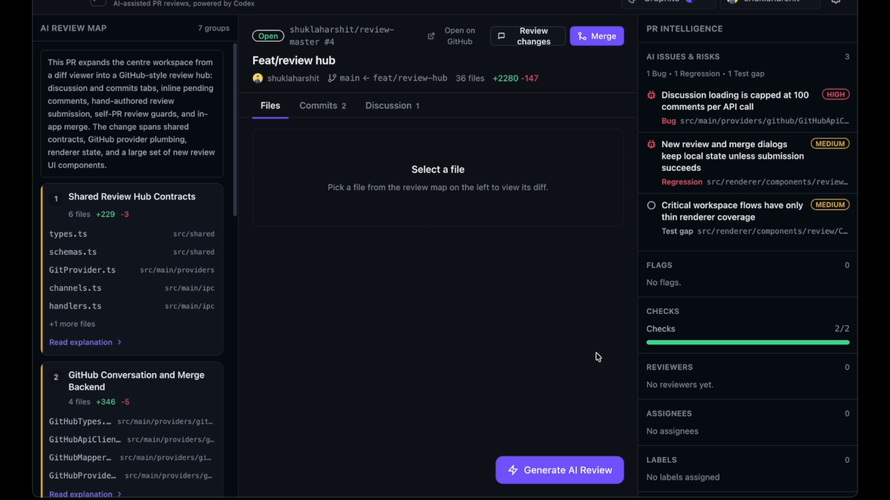
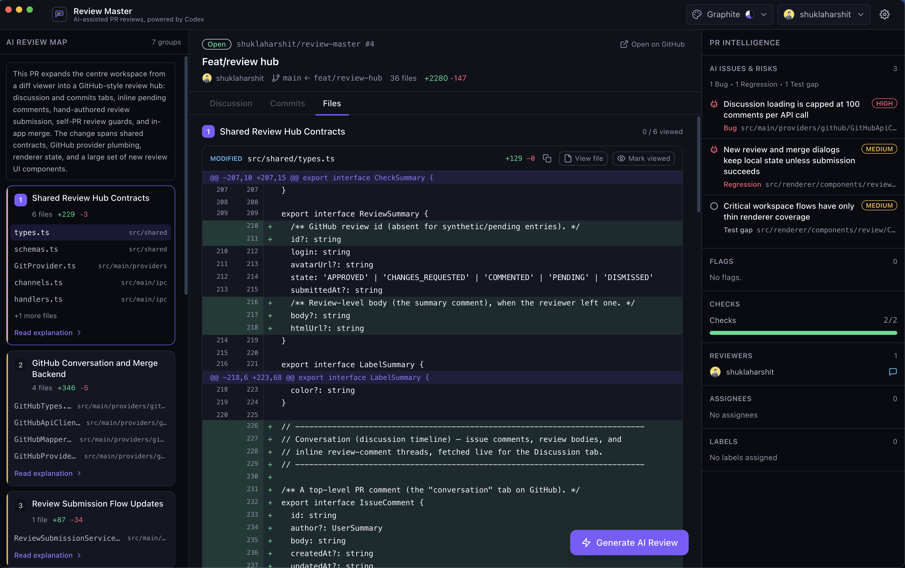
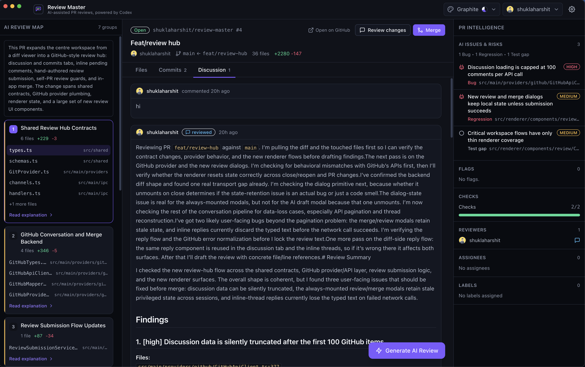
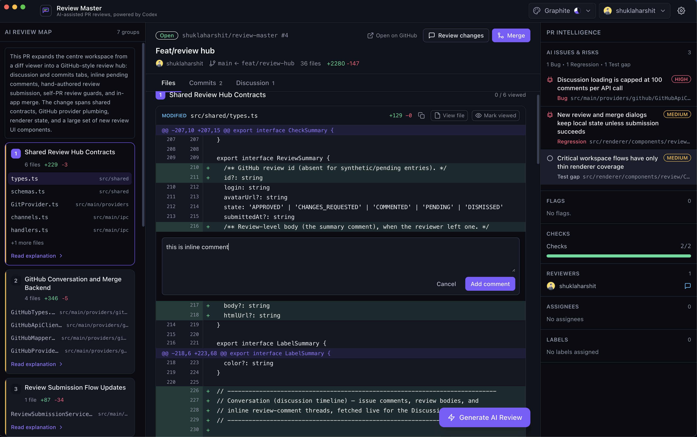
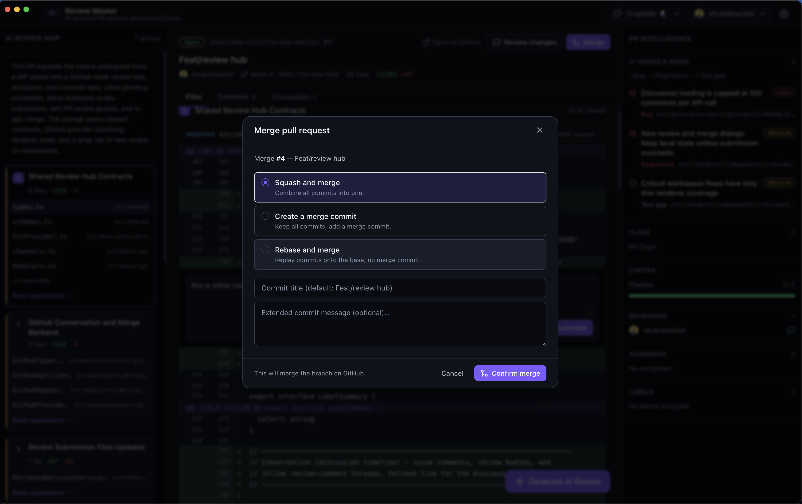

<div align="center">


# Review Master

**AI-assisted pull-request reviews — open-source, local-first, on your own Codex account.**

Review Master is a desktop app that turns a chaotic PR diff into a guided review: context first, files in the right order, risks surfaced early, and a complete GitHub review — comments, inline notes, approve / request changes, even merge — without leaving the window. Your code goes to OpenAI through *your* Codex account; it never touches a vendor's servers.

[](./LICENSE)
[](https://github.com/shuklaharshit/review-master/actions/workflows/test.yml)
[](https://github.com/shuklaharshit/review-master/releases)
[](#prerequisites)
[](./CONTRIBUTING.md)
[](https://github.com/shuklaharshit/review-master/stargazers)

</div>

<!--
  HERO: a committed .mp4 referenced by a relative path does NOT autoplay inline
  on GitHub, so we show a clickable poster that opens the video in GitHub's
  viewer. To get an autoplaying INLINE video instead, drag assets/hero.mp4 into a
  GitHub PR/issue comment, copy the generated https://github.com/user-attachments/…
  URL, and replace the block below with:
    <video src="PASTE_USER_ATTACHMENTS_URL" controls muted autoplay loop width="860"></video>
-->
<div align="center">
  <a href="assets/hero.mp4">
    
  </a>
  <p><em>▶ <a href="assets/hero.mp4">Watch the full walkthrough — preflight to submitted review (48s)</a></em></p>
</div>

## Why Review Master

Most AI reviewers are a paid SaaS bot that you bolt onto your repo and that ships your code to a vendor's cloud. Review Master is the opposite:

- **🔓 Open source (MIT).** The whole app — not just an integration shim. Read it, fork it, ship it.
- **💻 Local-first desktop app.** It runs on your machine. GitHub tokens live in your OS keychain, never in a database, a log, or our servers (we don't have any).
- **🔑 Your own Codex / OpenAI account.** Reviews run through the [Codex CLI](https://github.com/openai/codex) you already log into. Your code goes to OpenAI under *your* terms — there's no middleman model host. **No per-seat fee** — you pay only your own usage.
- **🧭 A guided review, not a wall of comments.** Files are grouped and ordered, risks are surfaced first, and the AI draft only appears *after* you've actually looked at the change.

## Features

- **Guided review map** — a preflight pass groups changed files into a sensible review order, explains each group, and surfaces likely bugs, security, and regression risks up front.
- **The whole PR in one window** — diff, **commits**, and the full **discussion** (issue comments, reviews with their bodies, and inline comment threads) as tabs. Never tab back to github.com mid-review.
- **Inline comments, GitHub's way** — drop comments on diff lines and batch them into a single pending review.
- **AI review draft** — generate an editable markdown review with Codex, with a live preview, then refine it.
- **Submit like a human reviewer** — **Comment**, **Approve**, or **Request changes**, with the self-PR guard GitHub enforces, plus standalone comments and thread replies.
- **Merge in-app** — squash, merge commit, or rebase, with a confirmation.
- **Five themes** — system-wide skins that re-style the entire app instantly.

## Screenshots

<!-- Replace these with real captures (see assets/CAPTURE.md). -->

|  |  |
|---|---|
|  |  |
| **Guided workspace** — review map, diff, and PR intelligence side by side. | **Discussion** — comments, reviews, and inline threads in one timeline. |
|  |  |
| **Inline comments** — comment on any diff line, batched into one review. | **Review & merge** — approve / comment / request changes, then merge. |

## How it compares

> _As of 2026-06-29. Product names are trademarks of their respective owners; this table is informational, reflects each tool's own published documentation, and implies **no endorsement or affiliation**. Features and prices change — verify against each vendor before relying on them._

| | Open-source engine | Run locally / self-host | Uses **your own** LLM account | Per-seat fee | Where your code is sent |
|---|:---:|:---:|:---:|---|---|
| **Review Master** | ✅ MIT | ✅ desktop app | ✅ your Codex / OpenAI | **None** — you pay only your own usage | OpenAI, via *your* account |
| [PR-Agent (Qodo)](https://github.com/qodo-ai/pr-agent) | ✅ Apache-2.0 | ✅ Docker / Action / CLI | ✅ your API keys | None (BYO usage) | your LLM provider |
| [CodeRabbit](https://www.coderabbit.ai/) | ❌ | Enterprise only | ❌ | $24–60 / seat / mo (free for public repos) | CodeRabbit cloud → OpenAI / Anthropic |
| [Greptile](https://www.greptile.com/) | ❌ | Enterprise only | Enterprise (BYO / self-host LLM) | $30 / seat / mo + credits | Greptile cloud → OpenAI / Anthropic |
| [Devin Review](https://cognition.com/blog/devin-review) | ❌ | ❌ | ❌ | Free during early release | Cognition cloud |
| [GitHub Copilot review](https://docs.github.com/en/copilot/concepts/agents/code-review) | ❌ | ❌ | ❌ | Paid tiers ($10–39 / mo) | GitHub / Microsoft cloud |

Review Master's bet is ownership: it's the only open-source reviewer that runs as a **local desktop app on your own model account**. If you'd rather have a hosted bot manage everything for you, the SaaS tools above are excellent at that — this is the tool for people who want to keep their code and their keys on their own machine.

> **Today:** GitHub only; primary platform is macOS (Windows/Linux build targets are configured but less exercised). GitLab and Bitbucket are stubbed as "coming soon."

## Prerequisites

- **macOS** (primary target), Node.js **20+**
- [Yarn](https://classic.yarnpkg.com/) (this project uses Yarn strictly)
- [Codex CLI](https://github.com/openai/codex): `npm install -g @openai/codex`, then `codex login`
- `git` on your `PATH` (recommended; otherwise the GitHub API patch fallback is used)

## Quick start

```bash
git clone https://github.com/shuklaharshit/review-master.git
cd review-master
yarn install
yarn dev          # launch the app with hot reload
```

Other scripts:

```bash
yarn typecheck    # tsc for main + renderer
yarn test         # vitest unit tests
yarn build        # production build (electron-vite)
```

To package installers locally: `yarn build && yarn electron-builder`.

## Configuration

Review Master authenticates to GitHub as a **GitHub App via the OAuth device flow** (no embedded secret, no dependency on the `gh` CLI). Set the App's public identity via environment variables (see `src/shared/constants.ts` and `.env`):

- `REVIEW_MASTER_GITHUB_CLIENT_ID` — the GitHub App's public client id
- `REVIEW_MASTER_GITHUB_APP_SLUG` — the App slug (the `<slug>` in `github.com/apps/<slug>`)

Tokens obtained through the flow are stored in your **OS keychain** — never in SQLite, logs, or the renderer.

## Architecture

A trusted Electron **main process** is the control plane. The **renderer** never touches tokens, Codex, git, the filesystem, or the GitHub/Codex APIs directly — it talks only to a typed IPC bridge.

```
Renderer (React) ── typed IPC (preload) ──▶ Main process
                                              ├── App services (bootstrap, settings, updates)
                                              ├── Git provider registry → GitHubProvider (Octokit, device-flow auth)
                                              ├── Codex runtime (CodexProcessManager → `codex app-server`)
                                              ├── PR services (context, diff, preflight, AI review, submission, merge)
                                              ├── SQLite (better-sqlite3) local persistence
                                              └── Secure token storage (keytar / OS keychain)
```

- **Codex** is integrated via a long-lived `codex app-server` child process speaking JSON-RPC over stdio. The renderer only ever sees canonical app events.
- **Diff** uses a local git repo cache when available, falling back to GitHub's API patches.

See [`ARCHITECTURE.md`](./ARCHITECTURE.md) for the full process model, contract layer, and data flows.

## Documentation

- [`AGENTS.md`](./AGENTS.md) — start here. Orientation for agents/humans: repo map, commands, invariants, gotchas.
- [`ARCHITECTURE.md`](./ARCHITECTURE.md) — process model, the contract layer, key data flows, the Codex integration.
- [`CONTRIBUTING.md`](./CONTRIBUTING.md) — setup + recipes (add an IPC method, add a provider, debug Codex), testing.
- [`docs/adr/`](./docs/adr/) — architecture decision records (the "why" behind load-bearing choices).

## Contributing

Contributions are welcome. Start with [`CONTRIBUTING.md`](./CONTRIBUTING.md) and [`AGENTS.md`](./AGENTS.md), and please run `yarn typecheck && yarn test` before opening a PR.

## License

[MIT](./LICENSE)
